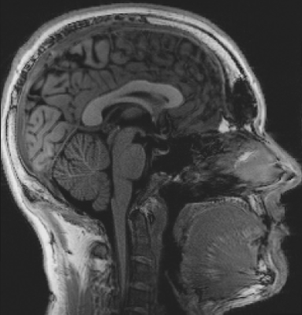
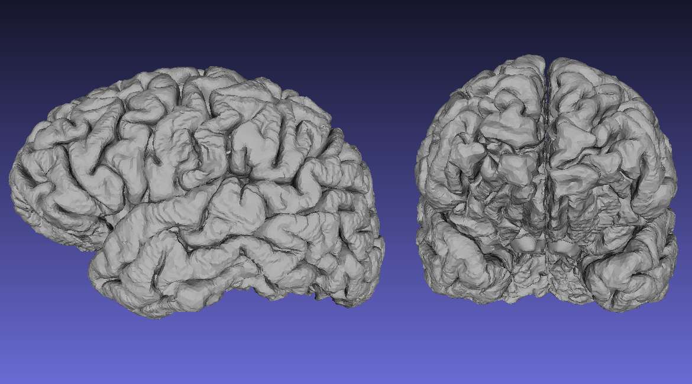
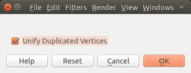
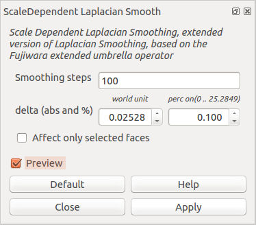
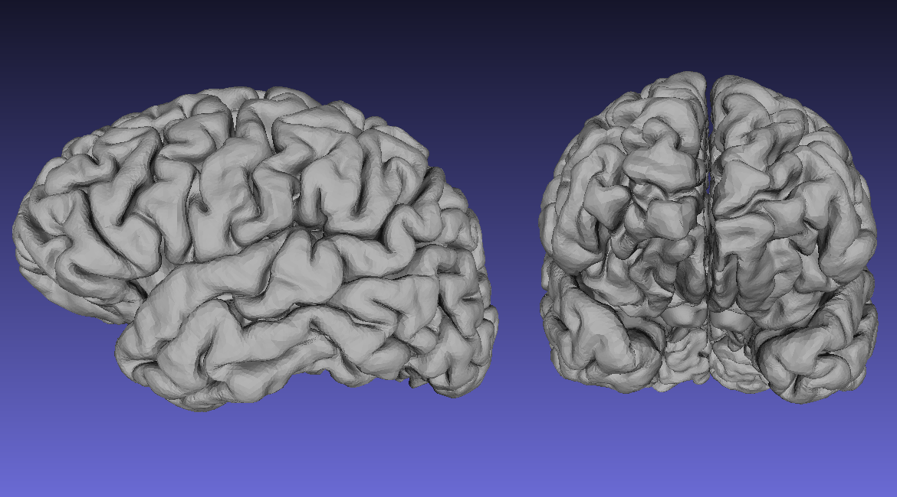
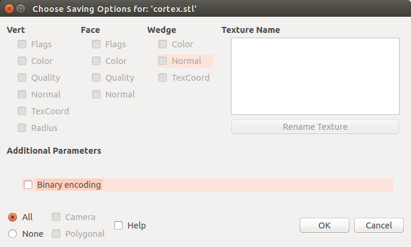
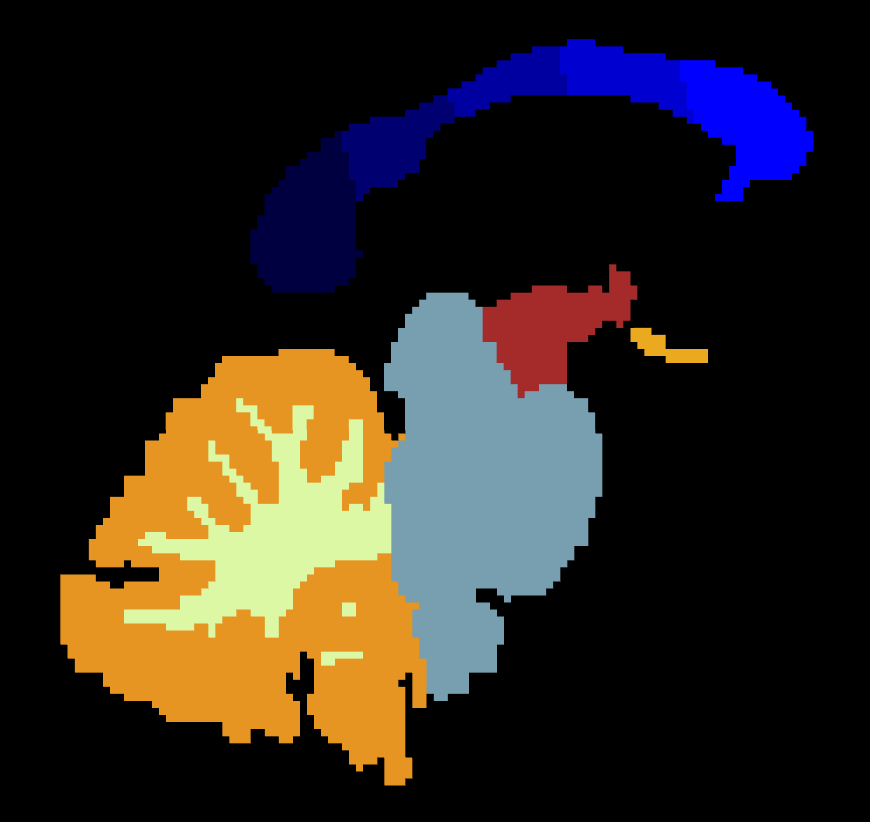
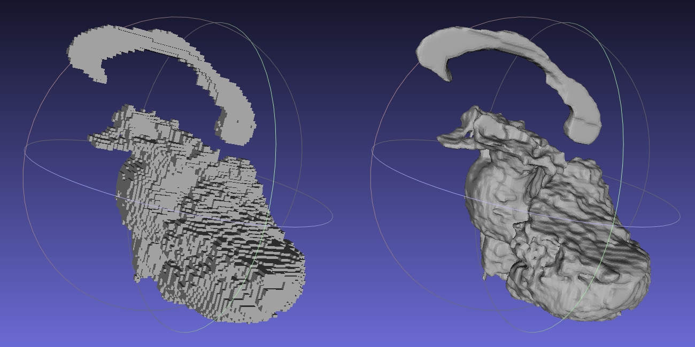
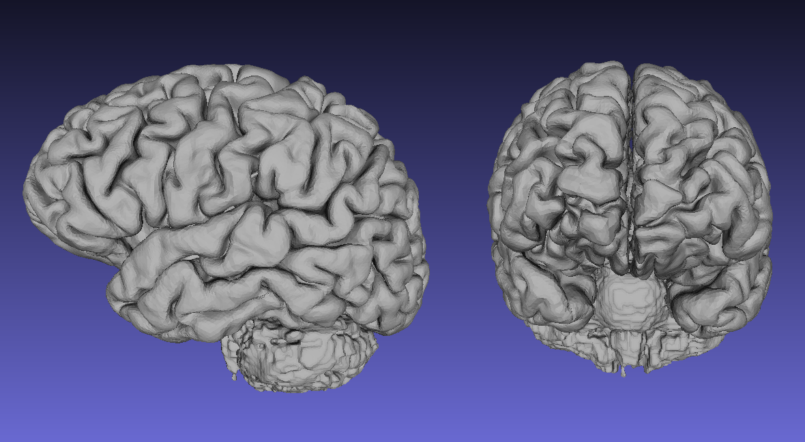
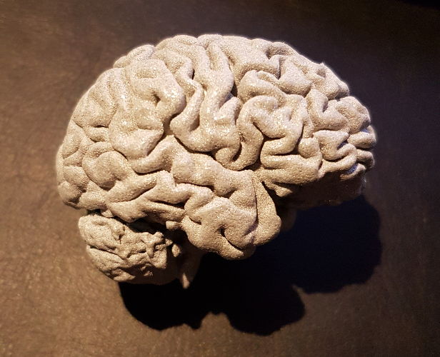

# 3D print your brain

So, you want to 3D print your own brain? The following is a step by step guide that will tell you how to 3D print a brain. All coming from a structural image (T1) like this:



**Note:** To create a 3D surface model of your brain we will use [FreeSurfer](http://freesurfer.net/) and [meshlab](http://meshlab.sourceforge.net/). Therefore you should make sure that those two softwares are already installed on your system.


## 1. Specify Variables

Let's first specify all necessary variables that we need for this to work:

```bash
# Main folder for the whole project
export EXPERIMENT_DIR=/users/mnotter/3dbrain

# Path to the FreeSurfer folder
export SUBJECTS_DIR=$EXPERIMENT_DIR/freesurfer

# Name of the subject
export subject=sub001

# Path to the structural image
export subjT1=$EXPERIMENT_DIR/${subject}/struct.nii.gz
```


## 2. Create Surface Model with FreeSurfer

Assuming that you have your structural image in NIfTI format, run the following code:

```bash
mkdir -p $SUBJECTS_DIR/${subject}/mri/orig
mri_convert ${subjT1} $SUBJECTS_DIR/${subject}/mri/orig/001.mgz
recon-all -subjid ${subject} -all -time -log logfile -nuintensitycor-3T
```

**Note:** This step might take some time. Between 6-18h. If you want to run ``recon-all`` in parallel and speed-up the whole process, add `` -openmp N`` to the end of the ``recon-all`` command, where ``N`` stands for the number of CPUs to use.


## 3. Create 3D Model of Cortical Areas

The following code will take the reconstructed surface model of both hemisphere's, concatenate them and save them under ``cortical.stl``

```bash
mris_convert --combinesurfs $SUBJECTS_DIR/${subject}/surf/lh.pial $SUBJECTS_DIR/${subject}/surf/rh.pial \
             $SUBJECTS_DIR/cortical.stl
```

Now let's look at the data with ``meshlab``. Therefore use the following code:

```bash
meshlab $SUBJECTS_DIR/cortical.stl
```

You should see something like this:



**Note:** If you have the following display message, just accept with **OK**.



This version of your surface reconstruction is still rather rough. So lets smooth it abit. Therefore, go to

```
Filters
    > Smoothing, Fairing, and Deformation
        > ScaleDependent Laplacian Smooth
```

This should open up the following window:



Just set ``Smoothing steps`` to ``100`` and ``perc on`` under ``delta (abs and %)`` to ``0.100``. And finally press ``Apply``. You should now have something that looks like this:



After this step, click on ``File`` and ``Export Mesh`` and save the whole thing without ``Binary encoding``, i.e.:



Press ``OK`` and close ``meshlab`` again.


## 4. Extract the Subcortial Areas of Interest

Now, FreeSurfer creates a very nice 3D model of the surface. Which unfortunately it doesn't do for subcortical structures, cerebellum and brainstem. Assuming that you want to print those areas too, we have to create a 3D surface model of them first. One way to do this is to use FreeSurfer's segmentation file ``aseg.mgz``.

```bash
# First, convert aseg.mgz into NIfTI format
mri_convert $SUBJECTS_DIR/${subject}/mri/aseg.mgz $EXPERIMENT_DIR/subcortical.nii

# Second, binarize all Areas that you're not interested and inverse the binarization
mri_binarize --i $EXPERIMENT_DIR/subcortical.nii \
             --match 2 3 24 31 41 42 63 72 77 51 52 13 12 43 50 4 11 26 58 49 10 17 18 53 54 44 5 80 14 15 30 62 \
             --inv \
             --o $EXPERIMENT_DIR/bin.nii

# Third, multiply the original aseg.mgz file with the binarized files
fslmaths $EXPERIMENT_DIR/subcortical.nii \
         -mul $EXPERIMENT_DIR/bin.nii \
         $EXPERIMENT_DIR/subcortical.nii.gz
```

**Note:** To figure out the value of the areas of no interest in the second step open ``aseg.mgz`` in the NIfTI viewer of your choice. With FreeSurfer it would be as follows: ``freeview -v $SUBJECTS_DIR/${subject}/mri/aseg.mgz -colormap lut``

After this step you'll have a NIfTI file that only contains the areas you were interested in. It should look something like this:



## 5. Create 3D Model of Subcortical Areas

The next step is now to turn those subcortical regions into a 3D model.

```bash
# Copy original file to create a temporary file
cp $EXPERIMENT_DIR/subcortical.nii.gz $EXPERIMENT_DIR/subcortical_tmp.nii.gz

# Unzip this file
gunzip -f $EXPERIMENT_DIR/subcortical_tmp.nii.gz

# Check all areas of interest for wholes and fill them out if necessary
for i in 7 8 16 28 46 47 60 251 252 253 254 255
do
    mri_pretess $EXPERIMENT_DIR/subcortical_tmp.nii \
    $i \
    $SUBJECTS_DIR/${subject}/mri/norm.mgz \
    $EXPERIMENT_DIR/subcortical_tmp.nii
done

# Binarize the whole volume
fslmaths $EXPERIMENT_DIR/subcortical_tmp.nii -bin $EXPERIMENT_DIR/subcortical_bin.nii

# Create a surface model of the binarized volume with mri_tessellate
mri_tessellate $EXPERIMENT_DIR/subcortical_bin.nii.gz 1 $EXPERIMENT_DIR/subcortical

# Convert binary surface output into stl format
mris_convert $EXPERIMENT_DIR/subcortical $EXPERIMENT_DIR/subcortical.stl
```

Next, open ``subcortical.stl`` with ``meshlab`` and apply ``ScaleDependent Laplacian Smooth`` as under step 3.

```bash
meshlab subcortical.stl
```

The output you get should be as follows:



On the left you see the surface reconstruction before smoothing, just after the tesselation and on the right you see the smoothed subcortical surface model after scale dependent laplacian smoothing.

Now, as before: Click on ``File`` and ``Export Mesh`` and save the whole thing without ``Binary encoding``.


## 7. Combine Cortical and Subcortial 3D Models

Now it's a short thing to concatenate the two files, ``cortical.stl`` and ``subcortical.stl`` into one ``final.stl`` file:

```bash
echo 'solid '$EXPERIMENT_DIR'/final.stl' > $EXPERIMENT_DIR/final.stl
sed '/solid vcg/d' $EXPERIMENT_DIR/cortical.stl >> $EXPERIMENT_DIR/final.stl
sed '/solid vcg/d' $EXPERIMENT_DIR/subcortical.stl >> $EXPERIMENT_DIR/final.stl
echo 'endsolid '$EXPERIMENT_DIR'/final.stl' >> $EXPERIMENT_DIR/final.stl
```


## 8. Clean-up Temporary Output

```bash
rm $EXPERIMENT_DIR/bin.nii \
   $EXPERIMENT_DIR/subcortical_bin.nii.gz \
   $EXPERIMENT_DIR/subcortical_tmp.nii \
   $EXPERIMENT_DIR/subcortical.nii \
   $EXPERIMENT_DIR/subcortical.nii.gz \
   $EXPERIMENT_DIR/subcortical
```

## 9. Reduce File Size

Use again ``meshlab`` to load ``final.stl``.

```bash
meshlab final.stl
```



Now, as a final step: Export the mesh again, but this time use ``Binary encoding``. This will reduce the data volume dramatically and will make it easier to send or upload the 3D model.


## 10. Print 3D Model via Internet

So, now to the final steps. If you're lucky enough and you have you have your own access to a 3D printer, than you probably no what to do next. Lucky you!

If you don't have access to a 3D printer, than there are many options on the internet. I personally used [www.shapeways.com](https://www.shapeways.com). It's very easy to use, you can choose from many different materials and it gives you also the option to resize your model, as well as correct for flawed surface areas.


## 11. The Final product

And this is how the final product might look like:

